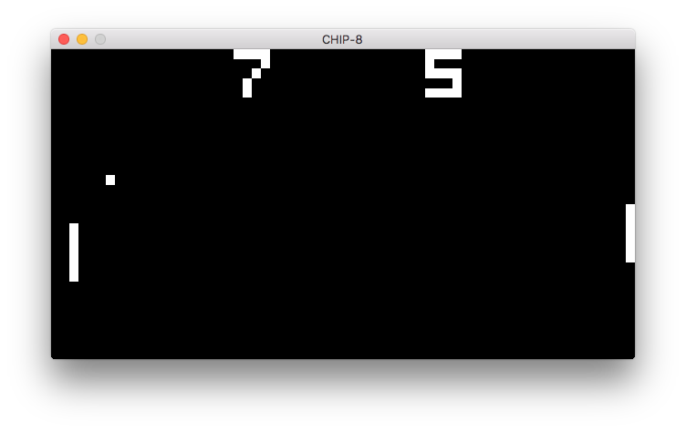
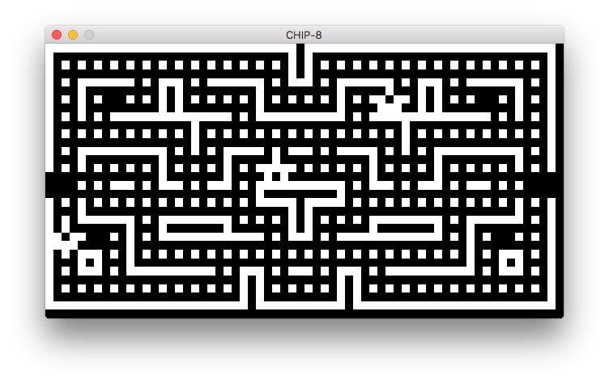

# CHIP-8 interpreter [](https://travis-ci.org/splintah/chip-8)

A CHIP-8 interpreter written in Rust, using OpenGL for the display.

## Screenshots





## Installation

If `cargo` is installed (see the [Rust website](https://rust-lang.org)):

```bash
$ cargo install chip-8 --git https://github.com/splintah/chip-8
$ chip-8 <file>
```

## Games

A pack of 15 CHIP-8 games can be found here: [Chip-8 Games Pack](https://www.zophar.net/pdroms/chip8/chip-8-games-pack.html).

## Controls

The key mapping is as follows:

```
Keypad         Keyboard
+-+-+-+-+      +-+-+-+-+
|1|2|3|C|      |1|2|3|4|
+-+-+-+-+      +-+-+-+-+
|4|5|6|D|      |Q|W|E|R|
+-+-+-+-+  =>  +-+-+-+-+
|7|8|9|E|      |A|S|D|F|
+-+-+-+-+      +-+-+-+-+
|A|0|B|F|      |Z|X|C|V|
+-+-+-+-+      +-+-+-+-+
```

## TODO

- Make key mapping configurable.
- Add tests.
- Add benches.
- Add configurable pixel width multiplier.

## Reference

- [Cowgod's Chip-8 Technical Reference v1.0](http://devernay.free.fr/hacks/chip8/C8TECH10.HTM)

## Licence

MIT
